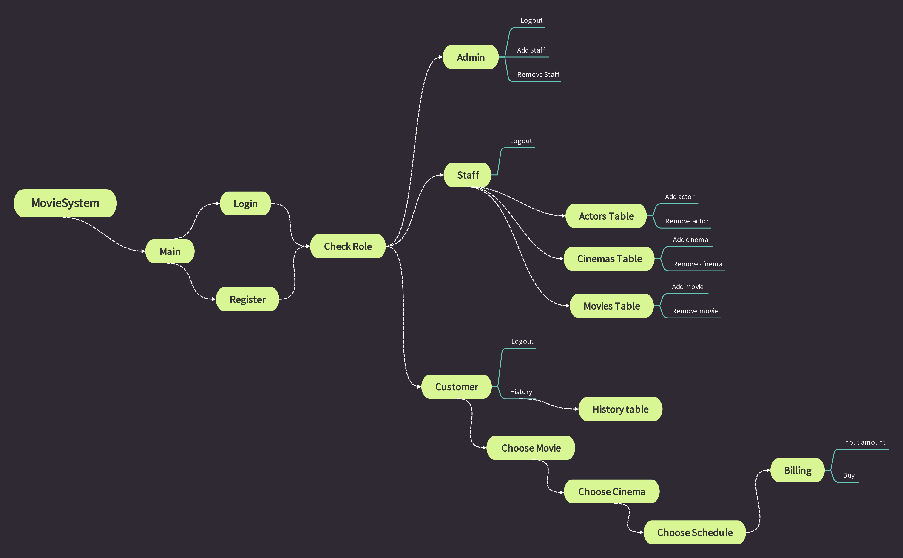

# Movie System Project

## Collaborators
- Nguyễn Phúc Vinh - ITITIU21350.
- Hoàng Gia Huy - ITCSIU21186.
- Lê Khánh Nguyên - ITCSIU21211.

## Main functions
- Booking tickets.
- Store booking history.
- Modify booking system.

## Library
- All library we use for this project you can find in `lib` folder.

## ERD
- [`ERD`](./lib/ERD/ERD/MovieSystem.erdplus)
- [`SCHEMA`](./lib/ERD/ERDSchema/MovieSysyemSchema.erdplus)

## Mind Map

### Core
- Java web application (Servlet).
- Apache Tomcat®.
- JDK 21.
- MySQL or SQL Server.
- Jakarta Standard Tag Library.

### Setup project
- Create database by using [`create_mysql.sql`](./lib/sql/create_mysql.sql) or [`create_sqlserver.sql`](./lib/sql/create_sqlserver.sql).
- Insert sample data by using [`insert.sql`](./lib/sql/insert.sql).
- Or using [`Generate "Customer" and "Password"`](./lib/GenerateData/app.py)